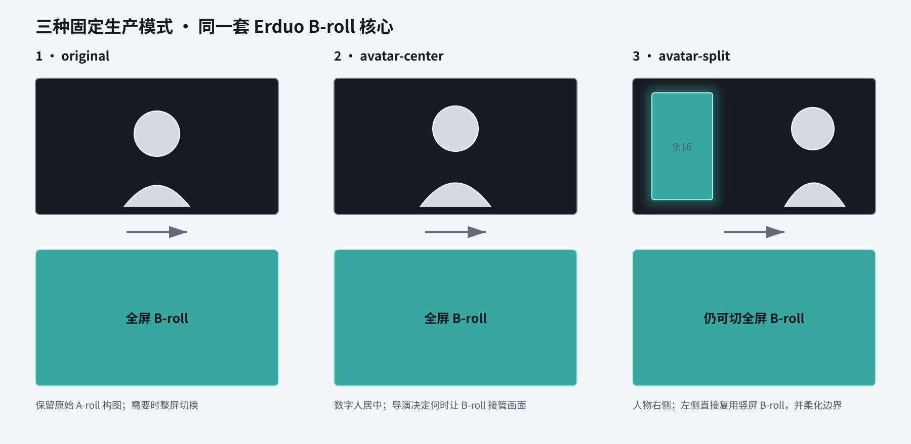

# Presenter composition modes

Use this reference when a production includes human or digital presenter media.
The mode changes only the presenter composition layer. It never replaces,
restyles, crops, or rewrites the approved B-roll DesignMD.

## Frozen modes

| Mode | Presenter | B-roll | Intended use |
| --- | --- | --- | --- |
| `original` | Preserve the approved human/digital source framing | Full-frame cutaway | Existing presenter workflow and human A-roll |
| `avatar-center` | Approved digital presenter centered full frame | Full-frame cutaway | Direct-to-camera explanation with occasional visual replacement |
| `avatar-split` | Approved digital presenter remains the full-frame base with the subject on the right | Reuse a 9:16 B-roll shot in the left overlay; explicit full-frame cutaway remains allowed | 16:9 YouTube/talking-head output that reuses the stable short-video B-roll system |

`avatar-split` deliberately overlays the vertical B-roll on the approved
presenter background instead of inventing a new half-screen theme. The
compositor adds a restrained soft edge around the overlay. The B-roll itself is
byte-identical to the validated 9:16 shot and keeps its original DesignMD.
An explicit full-frame cutaway in a 16:9 output uses a separately rendered
1920×1080 variant from the same Recipe, original DesignMD, timing, and visible
text. Split windows continue to use the validated 9:16 variant. Only a partial,
non-publishable `framework-demo` may fall back to keeping the complete portrait
frame centered over a dimmed same-shot blur carrier. Canary and full production
fail when a requested full cutaway has no verified landscape variant.

An external legacy B-roll root may be reused only for a partial
`framework-demo`. The compositor must prove identical original SRT, DesignMD,
production profile, Recipe truth, visual Recipe fields, media contract, hash,
and full decode; only `creativeProposal.presenterTreatment` may differ. The
receipt records the missing or historical Skill evidence and
`publishable=false`. Canary, full production, and publishing still require
current per-video Skill sidecars. Historical outputs are never backfilled.

## Selection and approval

Create `00-inputs/presentation-mode.json` with
`scripts/create-presentation-mode.mjs`. A draft may be shown for review, but
Runtime planning accepts only `approval.status=approved` and
`approvedBy=user`. The contract binds:

- original DesignMD;
- B-roll production profile;
- presenter source when present;
- final output raster;
- one frozen mode and layout policy.

The user approves the visual plan before any presenter canary render. Changing
the mode, presenter source, B-roll profile, output raster, or original DesignMD
requires a new contract and Runtime Plan identity.

## Recipe behavior

`creativeProposal.presenterTreatment` still decides timing:

- `presenter`: presenter only;
- `broll`: full-frame B-roll;
- `mixed`: presenter outside `brollWindows`.

Inside a mixed window, `presentation=full` requests a full-frame cutaway and
`presentation=split` requests the approved split layout. When the production
mode is `avatar-split`, an omitted `presentation` defaults to `split`; the other
two modes default to `full`. A split request under another mode fails before
composition.
